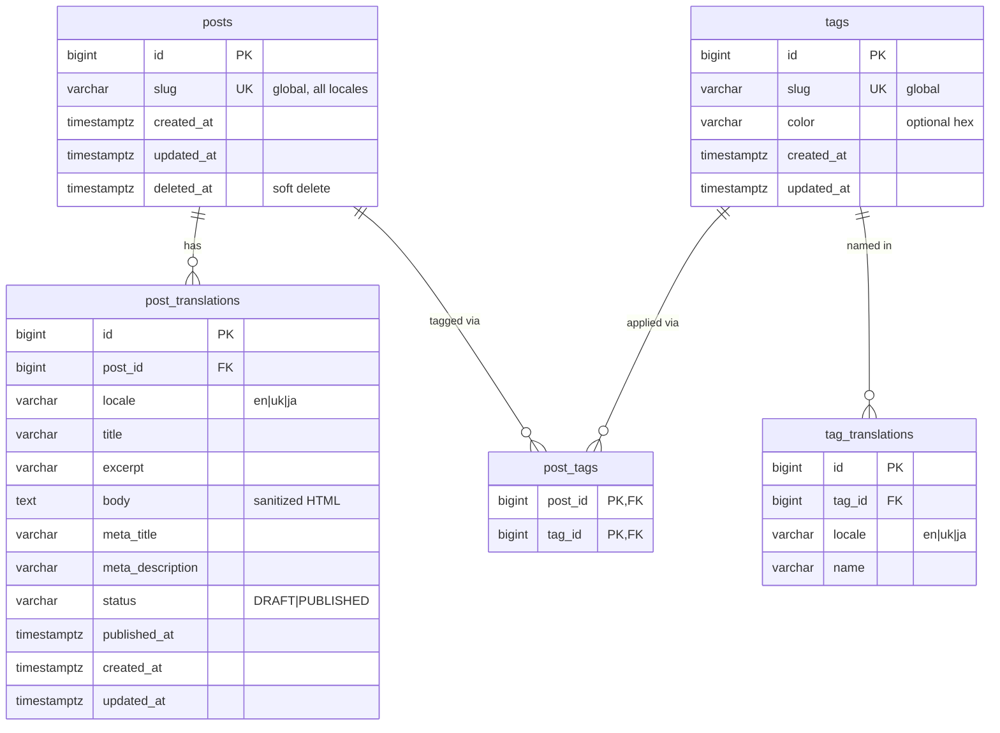

# ERD — Blog Feature

**Status:** Design input · **Date:** 2026-05-28

**Feeds into:** the Phase 1.1 Flyway migration and the Post/Tag JPA entities.

## Purpose

This document is the data-model spec for the blog feature, distilled from the
PRD and planning docs. It is DDL-ready: every column lists its Postgres type,
nullability, default, and the constraints/indexes it participates in. Scope is
the blog only.

Two structural decisions drive the shape of the model:

- **Locale split.** Locale-independent facts (slug, lifecycle timestamps) live
  on the parent entity (`posts` / `tags`); everything translatable lives in a
  child `*_translations` table keyed by `locale`. The slug is shared across all
  locales and therefore stays on `posts`.
- **Per-translation publishing.** Publish state (`status`, `published_at`) lives
  on `post_translations`, not `posts`. A post can be `PUBLISHED` in English
  while Ukrainian and Japanese are still drafts, and the public list for a given
  locale only shows posts that have a `PUBLISHED` translation in that locale.

Supported locales: `en` (default), `uk`, `ja`. No language fallback.

## Entities

### `posts` — locale-independent core

| Column | Type | Null | Default | Notes |
|---|---|---|---|---|
| `id` | `BIGINT GENERATED ALWAYS AS IDENTITY` | no | — | PK |
| `slug` | `VARCHAR(255)` | no | — | **global**, shared across all locales; `UNIQUE` |
| `created_at` | `TIMESTAMPTZ` | no | `now()` | |
| `updated_at` | `TIMESTAMPTZ` | no | `now()` | bumped on update |
| `deleted_at` | `TIMESTAMPTZ` | yes | `NULL` | soft delete; non-null = hidden from public |

- No `status` / `published_at` column — publishing is per-translation.
- `cover_image` is deliberately omitted. The PRD defers it to Phase 4 as a
  nullable, non-breaking migration once the media-upload pipeline exists.

### `post_translations` — per-locale content + publish state

| Column | Type | Null | Default | Notes |
|---|---|---|---|---|
| `id` | `BIGINT … IDENTITY` | no | — | PK |
| `post_id` | `BIGINT` | no | — | FK → `posts(id)` `ON DELETE CASCADE` |
| `locale` | `VARCHAR(5)` | no | — | `CHECK (locale IN ('en','uk','ja'))` |
| `title` | `VARCHAR(255)` | no | — | |
| `excerpt` | `VARCHAR(500)` | yes | `NULL` | shown in the list view |
| `body` | `TEXT` | no | — | server-sanitized HTML (OWASP Java HTML Sanitizer) |
| `meta_title` | `VARCHAR(255)` | yes | `NULL` | SEO, per-locale |
| `meta_description` | `VARCHAR(320)` | yes | `NULL` | SEO, per-locale |
| `status` | `VARCHAR(16)` | no | `'DRAFT'` | `CHECK (status IN ('DRAFT','PUBLISHED'))` |
| `published_at` | `TIMESTAMPTZ` | yes | `NULL` | set on first publish; never overwritten on re-publish |
| `created_at` | `TIMESTAMPTZ` | no | `now()` | |
| `updated_at` | `TIMESTAMPTZ` | no | `now()` | |

- `read_time` is **not** stored — it is derived server-side from the `body` word
  count (200 wpm) and returned only as an API field.

### `tags` — controlled vocabulary, locale-independent

| Column | Type | Null | Default | Notes |
|---|---|---|---|---|
| `id` | `BIGINT … IDENTITY` | no | — | PK |
| `slug` | `VARCHAR(255)` | no | — | **globally unique**; `UNIQUE` |
| `color` | `VARCHAR(7)` | yes | `NULL` | optional hex (`#RRGGBB`) |
| `created_at` | `TIMESTAMPTZ` | no | `now()` | |
| `updated_at` | `TIMESTAMPTZ` | no | `now()` | |

- No soft delete. A tag is hard-deletable only when unassigned; deletion while
  it is assigned to one or more posts is blocked by the `post_tags` FK
  (`ON DELETE RESTRICT`) and surfaced as a validation error by the API.

### `tag_translations` — per-locale tag names

| Column | Type | Null | Default | Notes |
|---|---|---|---|---|
| `id` | `BIGINT … IDENTITY` | no | — | PK |
| `tag_id` | `BIGINT` | no | — | FK → `tags(id)` `ON DELETE CASCADE` |
| `locale` | `VARCHAR(5)` | no | — | `CHECK (locale IN ('en','uk','ja'))` |
| `name` | `VARCHAR(100)` | no | — | |

- `UNIQUE (tag_id, locale)` — one name per locale per tag.
- `UNIQUE (locale, name)` — translated name unique per locale (PRD).

### `post_tags` — M:N join

| Column | Type | Null | Notes |
|---|---|---|---|
| `post_id` | `BIGINT` | no | FK → `posts(id)` `ON DELETE CASCADE` |
| `tag_id` | `BIGINT` | no | FK → `tags(id)` `ON DELETE RESTRICT` |

- Composite PK `(post_id, tag_id)`; secondary index on `tag_id` for reverse
  lookups (find all posts for a tag).

## Constraints & indexes summary

- `UNIQUE posts(slug)`; partial index `posts(deleted_at) WHERE deleted_at IS NULL`.
- `UNIQUE post_translations(post_id, locale)`; index
  `post_translations(locale, status, published_at DESC)` — backs the paginated,
  locale-filtered, published-only list sorted by `published_at` descending.
- `UNIQUE tags(slug)`.
- `UNIQUE tag_translations(tag_id, locale)`, `UNIQUE tag_translations(locale, name)`.
- `post_tags` PK `(post_id, tag_id)` + secondary index on `tag_id`.

## Relationships

- `posts 1 ──< post_translations` — a post has 1..3 translations (identifying).
- `posts >──< tags` via `post_tags` — many-to-many.
- `tags 1 ──< tag_translations` — a tag has 1..3 translations.

## Diagram

## Derived / deferred (documented, not columns)

- `read_time` — derived from the `body` word count (200 wpm); never stored.
- `cover_image` — deferred to Phase 4 (nullable, non-breaking migration later).
- `hreflang` links and the schema.org `Article` JSON-LD block — assembled by
  Next.js from the available translations; no DB column.

## Traceability to PRD acceptance criteria

| PRD criterion | Modeled by |
|---|---|
| Slug shared across locales; two posts can't share a slug | `posts.slug` + `UNIQUE posts(slug)` |
| Body sanitized server-side | `post_translations.body` (TEXT, sanitized on write) |
| Per-locale title/excerpt/body/SEO | `post_translations` columns |
| Translation publishes independently | `post_translations.status` + `published_at` |
| `published_at` set on first publish, not overwritten | `post_translations.published_at` (nullable, write-once) |
| Locale list shows only `PUBLISHED` translations | index `(locale, status, published_at DESC)` |
| Soft-delete a post | `posts.deleted_at` |
| Tag slug globally unique | `UNIQUE tags(slug)` |
| Tag name unique per locale | `UNIQUE tag_translations(locale, name)` |
| Tag has optional color + translated names | `tags.color`, `tag_translations` |
| Tag can't be deleted while assigned | `post_tags.tag_id` FK `ON DELETE RESTRICT` |
| Posts ↔ tags linked via join table | `post_tags` |
| Read time derived, not stored | (no column — computed in API) |
